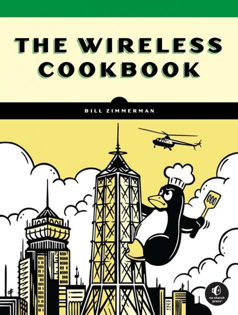

  

    
  

  

  ### The Wireless Cookbook
  #### A Practical Guide to Wi-Fi, Bluetooth, and LoRa Projects
  **Author:** Bill Zimmerman  
  **Tech Reviewer:** Lawrence Yau  
  (Co-creators of RaspAP)

  With a foreward by Jeff Geerling  

  **Publisher:** No Starch Press  
  **Publication Date:** November, 2025  
  **Pages:** 448  
  **ISBN-13:** 978-1-7185-0234-5  
  **Format:** Paperback, eBook  
  **Language:** English  

  <a href="https://nostarch.com/wireless-cookbook" target="_blank" class="btn btn-warning  px-5">Details</a>

  

Wireless networking combines two complex technologies—networking and radio frequencies—making it a challenging yet rewarding area to explore.  

_[The Wireless Cookbook](https://nostarch.com/wireless-cookbook)_ provides those skills through a hands-on, project-based approach designed for hobbyists, educators, and Linux enthusiasts. This book uses accessible step-by-step recipes to teach readers about Wi-Fi, Bluetooth, and Long Range (LoRa) technologies through practical, feature-rich projects built with Raspberry Pi and other single-board computers (SBCs).

Each chapter presents a self-contained project, guiding readers from foundational concepts to real-world applications as they gain fluency in Python and essential Linux tools, all while uncovering the capabilities of modern SBCs. 

Unlike theoretical guides, _[The Wireless Cookbook](https://nostarch.com/wireless-cookbook)_ emphasizes functional, customizable projects you can use in daily life or expand into your own creations, providing the knowledge and confidence to experiment with cutting-edge technologies.
  
Covers the fundamentals of the 802.11 wireless (Wi-Fi) protocol, Bluetooth Low Energy (BLE), Long Range (LoRa) wireless, and the LoRaWAN protocol in depth.

