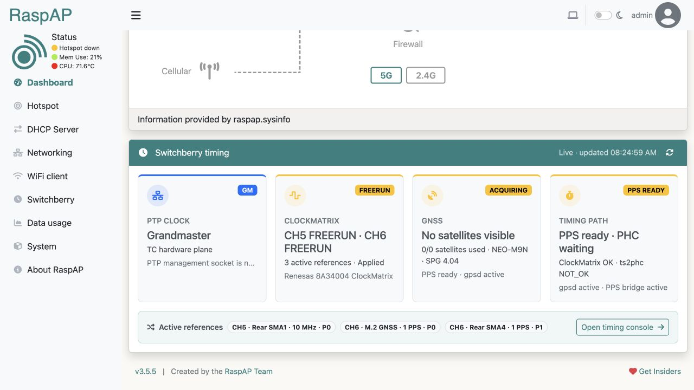
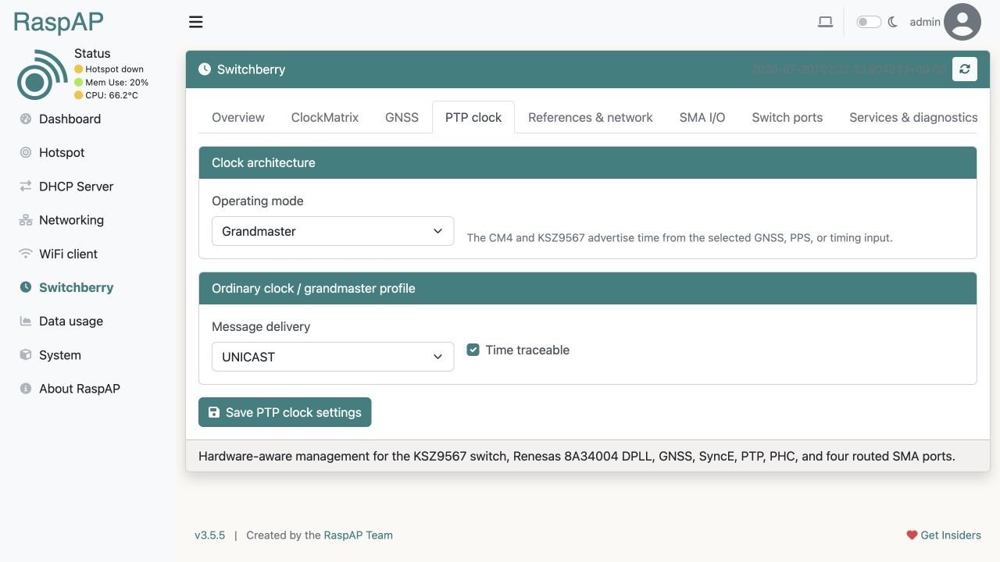
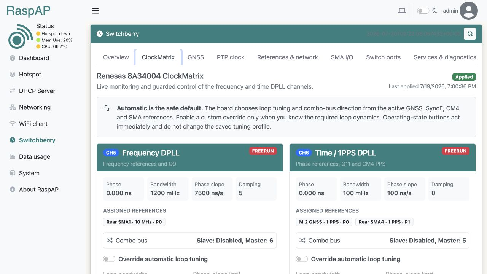
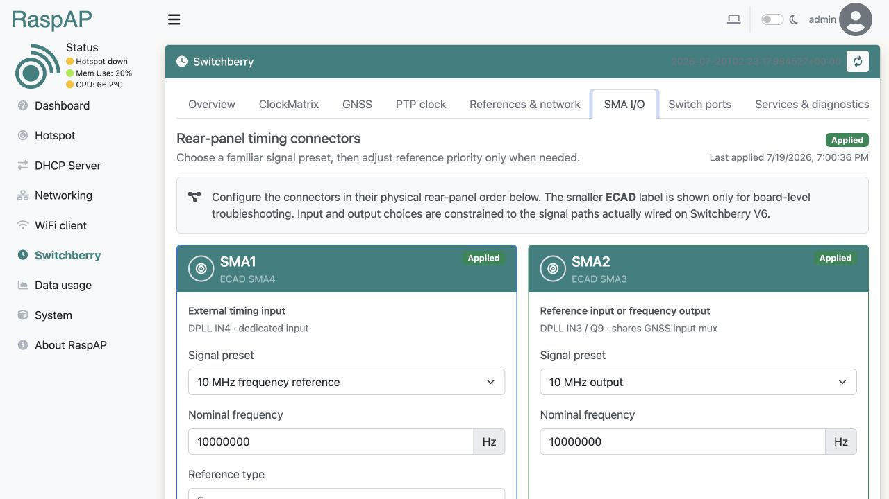
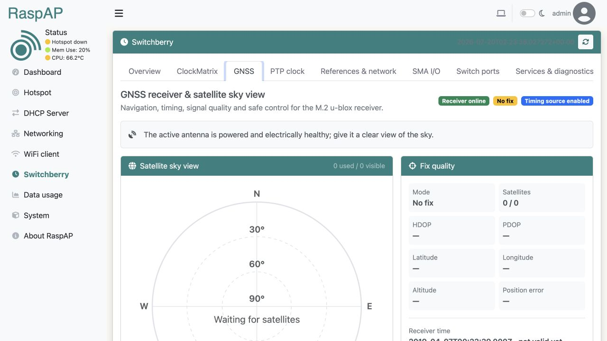

[](https://github.com/raspap/raspap-webgui/releases) [](https://github.com/thibmaek/awesome-raspberry-pi) [](https://github.com/sponsors/RaspAP) [](https://app.travis-ci.com/RaspAP/raspap-webgui) [](https://crowdin.com/project/raspap) [](https://twitter.com/rasp_ap) [](https://reddit.com/r/RaspAP) [](https://discord.gg/KVAsaAR)

RaspAP is feature-rich wireless router software that _just works_ on many popular [Debian-based devices](#supported-operating-systems), including the Raspberry Pi. Our [custom OS images](#pre-built-image), [Quick installer](#quick-installer) and [Docker container](#docker-support) create a known-good default configuration for all current Raspberry Pis with onboard wireless. A fully responsive, mobile-ready interface gives you control over the relevant services and networking options. Advanced DHCP settings, [WireGuard](https://docs.raspap.com/wireguard/), [Tailscale](https://docs.raspap.com/tailscale/) and [OpenVPN](https://docs.raspap.com/openvpn/) support, [SSL certificates](https://docs.raspap.com/ssl/), [ad blocking](#ad-blocking), security audits, [captive portal integration](https://docs.raspap.com/captive/), themes and [multilingual options](https://docs.raspap.com/translations/) are included.

RaspAP has been featured by [ZDNET](https://www.zdnet.com/home-and-office/networking/how-i-built-my-own-wifi-router-with-raspberry-pi/), [PC World](https://www.pcwelt.de/article/1789512/raspberry-pi-als-wlan-router.html), [MSN](https://www.msn.com/en-us/news/technology/4-reasons-i-installed-raspap-on-my-raspberry-pi/ar-AA1GLHdE), [Adafruit](https://blog.adafruit.com/2016/06/24/raspap-wifi-configuration-portal-piday-raspberrypi-raspberry_pi/), [Raspberry Pi Weekly](https://www.raspberrypi.org/weekly/commander/), and [Awesome Raspberry Pi](https://project-awesome.org/thibmaek/awesome-raspberry-pi) and implemented in [countless projects](https://raspap.com/awesome/).

We hope you enjoy using RaspAP as much as we do creating it. Tell us how you use this with [your own projects](https://raspap.com/awesome/).


## Contents

 - [Switchberry support](#switchberry-support)
   - [Live interface](#live-interface)
   - [Installation on Switchberry](#installation-on-switchberry)
   - [ClockMatrix control](#clockmatrix-control)
   - [GNSS receiver and sky view](#gnss-receiver-and-sky-view)
   - [PTP clock planes](#ptp-clock-planes)
   - [SMA timing I/O](#sma-timing-io)
 - [Quick start](#quick-start)
 - [Join Insiders](#join-insiders)
 - [WireGuard support](#wireguard-support)
 - [OpenVPN support](#openvpn-support)
 - [VPN Provider support](#vpn-provider-support)
 - [Ad Blocking](#ad-blocking)
 - [Bridged AP](#bridged-ap)
 - [Manual installation](#manual-installation)
 - [802.11ac 5GHz support](#80211ac-5ghz-support)
 - [Supported operating systems](#supported-operating-systems)
 - [HTTPS support](#https-support)
 - [Docker support](#docker-support)
 - [Custom user plugins](#custom-user-plugins)
 - [Multilingual support](#multilingual-support)
 - [How to contribute](#how-to-contribute)
 - [Reporting issues](#reporting-issues)
 - [License](#license)

## Quick start
RaspAP gives you two different ways to get up and running quickly. The simplest and recommended approach is to use a custom Raspberry Pi OS image with RaspAP preinstalled. This option eliminates guesswork and gives you a base upon which to build. Alternatively, you may execute the Quick installer on an existing [compatible OS](https://docs.raspap.com/#compatible-operating-systems).

> **Switchberry installations:** the standard installer enables timing support only after it verifies the board's KSZ9567. The dedicated [Switchberry installer](#installation-on-switchberry) is available when the existing management network must remain untouched.

### Pre-built image
Custom Raspberry Pi OS Lite images with the latest RaspAP are available for [direct download](https://github.com/RaspAP/raspap-webgui/releases/latest). This includes both 32- and 64-bit builds for ARM architectures.

| Operating system | Debian version | Kernel version | RaspAP version | Size |
| ------------ | -------------- | -------------- | -------------- | ---- |
| Raspberry Pi OS (64-bit) Lite | 13 (trixie) | 6.12 | Latest | 826 MB |
| Raspberry Pi OS (32-bit) Lite | 13 (trixie) | 6.12 | Latest | 799 MB |

These images are automatically generated with each release of RaspAP. You may choose between an `arm64` or `armhf` (32-bit) based build. Refer to [this resource](https://www.raspberrypi.com/software/operating-systems/) to ensure compatibility with your hardware.

After downloading your desired image from the [latest release page](https://github.com/RaspAP/raspap-webgui/releases/latest), use a utility such as the Raspberry Pi Imager or [balenaEtcher](https://www.balena.io/etcher) to flash the OS image onto a microSD card. Insert the card into your device and boot it up. The latest RaspAP release version with the most popular optional components will be active and ready for you to configure.

### Quick installer
Alternatively, start with a clean install of a [latest release of Raspberry Pi OS](https://www.raspberrypi.org/software/operating-systems/). Both the 32- and 64-bit release versions are supported, as well as the latest 64-bit Desktop distribution.

Update RPi OS to its latest version, including the kernel and firmware, followed by a reboot:

```
sudo apt-get update
sudo apt-get full-upgrade
sudo reboot
```
Set the WiFi country in raspi-config's **Localisation Options**: `sudo raspi-config`.

Install RaspAP from your device's shell prompt:
```sh
curl -sL https://install.raspap.com | bash
```

The Quick installer will respond to several [command line arguments](https://docs.raspap.com/quick/), or switches, to customize your installation in a variety of ways, or install one of RaspAP's optional helper tools.

### Initial settings
After completing either of these setup options, the wireless AP network will be configured as follows:

* IP address: `10.3.141.1`
  * Username: `admin`
  * Password: `secret`
* DHCP range: `10.3.141.50` — `10.3.141.254`
* SSID: `RaspAP`
* Password: `ChangeMe`

It's _strongly recommended_ that your first post-install action is to change the default admin [authentication](https://docs.raspap.com/authentication/) settings. Thereafter, your AP's [basic settings](https://docs.raspap.com/ap-basics/) and many [advanced options](https://docs.raspap.com/ap-basics#advanced-options) are now ready to be modified by RaspAP.

Please [read this](https://docs.raspap.com/issues/) before reporting an issue.

## Join Insiders

[](https://github.com/sponsors/RaspAP/)  

RaspAP is free software, but powered by _your_ support. If you find RaspAP useful for your personal or commercial projects, [become an Insider](https://github.com/sponsors/RaspAP/) and get early access to [exclusive features](https://docs.raspap.com/insiders/#exclusive-features) in the [Insiders Edition](https://docs.raspap.com/insiders/).

A tangible side benefit of sponsorship is that **Insiders** are able to help _steer future development of RaspAP_. This is done through Insiders' team access to discussions, feature requests, issues and more in the private GitHub repository.

## WireGuard support

WireGuard® is an extremely simple yet fast and modern VPN that utilizes state-of-the-art cryptography. It aims to be considerably more performant than OpenVPN, and is generally regarded as the most secure, easiest to use, and simplest VPN solution for modern Linux distributions.

WireGuard is included in the pre-built OS and may be optionally installed by the [Quick Installer](https://docs.raspap.com/quick/). Once this is done, you can manage local (server) settings, create a peer configuration and control the `wg-quick` service with RaspAP.

Details are [provided here](https://docs.raspap.com/wireguard/).

## OpenVPN support

OpenVPN is included in the pre-built OS and may be optionally installed by the Quick Installer. Once this is done, you can [manage client configurations](https://docs.raspap.com/openvpn/) and the `openvpn-client` service with RaspAP.

To configure an OpenVPN client, upload a valid .ovpn file and, optionally, specify your login credentials. RaspAP will store your client configuration and add firewall rules to forward traffic from OpenVPN's `tun0` interface to your configured wireless interface. 

See our [OpenVPN documentation](https://docs.raspap.com/openvpn/) for more information.

## VPN provider support

Several popular VPN providers include a Linux Command Line Interface (CLI) for interacting with their services. As a new beta feature, you may optionally control these VPN services from within RaspAP. After your provider's CLI is installed on your system you may administer it thereafter by using RaspAP's UI.

See our [VPN provider documentation](https://docs.raspap.com/providers/) for more information.

## Ad Blocking
This feature uses DNS blacklisting to block requests for ads, trackers and other undesirable hosts. Ad blocking is included in the pre-built OS and may be optionally installed by the [Quick Installer](https://docs.raspap.com/quick/). Thereafter, you may choose between several of the best available [blocklist sources](https://docs.raspap.com/features-core/adblock/#blocklist-sources) to suit your needs.

Details are [provided here](https://docs.raspap.com/adblock/).

## Bridged AP
By default RaspAP configures a routed AP for your clients to connect to. A bridged AP configuration is also possible. Select the **Bridged AP mode** toggle under the **Advanced** tab of **Hotspot**, configure a static IP address for the bridge interface, then save and restart the AP.

Details on Bridged AP mode are [provided here](https://docs.raspap.com/bridged/).

## Manual installation
Detailed manual setup instructions are [provided here](https://docs.raspap.com/manual/).

## 802.11ac 5GHz support
RaspAP provides an 802.11ac wireless mode option for supported hardware (currently the RPi 3B+, 4, 5 and compatible Orange Pi models) and wireless regulatory domains. See [this](https://docs.raspap.com/ap-basics/#80211ac-5-ghz) for more information.

## Switchberry support
RaspAP provides first-class support for the [Switchberry](https://github.com/Time-Appliances-Project/Switchberry) timing carrier. It verifies the KSZ9567 through a bound kernel driver or its SPI chip ID before identifying the board or exposing any Switchberry UI, services, packages or sudo permissions. Software markers alone are deliberately insufficient, so a plain Compute Module 4 or Compute Module 5 continues to use the regular RaspAP interface and model identity.

When the hardware is present, RaspAP adds a dedicated **Switchberry** management page with:

* a live Dashboard timing summary for PTP role and plane, ClockMatrix channels, GNSS acquisition, PPS/PHC health and active references;
* live state for all five KSZ9567 front-panel Ethernet ports;
* a dedicated Renesas 8A34004 ClockMatrix console with live channel state, phase, loop dynamics, assigned references, combo-bus topology and guarded operating-state controls;
* a GNSS console with receiver health, fix quality, coordinates, DOP, PPS/data-path status, constellation-aware satellite sky view, signal table and safe u-blox acquisition/profile controls;
* PTP role, clock plane, transport, per-port state, PHC synchronization, NTP and GNSS status;
* hardware transparent-clock configuration for E2E/P2P, one/two-step behavior, Layer 2/IPv4/IPv6 recognition, domain filtering, message priority and per-port ingress/egress/asymmetry calibration;
* a five-port P2P one-step hardware-timestamped boundary clock with IEEE 1588 BMCA policy, per-port client/server policy, intervals, latency, asymmetry and unicast master tables;
* validated GM, client, SyncE, GNSS, CM4 PPS and Ethernet management configuration;
* visual, preset-driven routing for all four rear SMA connectors, including input type, priority, exact/custom frequency, realized Q9 frequency, DPLL channel state and last successful hardware apply;
* Switchberry systemd health, recent logs, device nodes, M.2/PCI and USB diagnostics; and
* controlled port enable/disable and ordered timing-stack restart operations.



### Live interface

These screenshots were captured from a working Switchberry V6. The status badges reflect real hardware state: the GNSS receiver is online with a healthy powered antenna and PPS device, but is waiting for a clear satellite view, so the ClockMatrix correctly reports freerun rather than a false lock.

| PTP operating mode | ClockMatrix DPLL control |
| --- | --- |
|  |  |

| Rear-panel SMA routing | GNSS receiver and satellite sky view |
| --- | --- |
|  |  |

Privileged hardware access is isolated in `/usr/local/sbin/raspap-switchberryctl`. The helper accepts only fixed, validated actions; configuration is limited to 64 KiB, normalized before use, backed up under `/var/lib/raspap/switchberry-backups`, atomically written to `/etc/startup-dpll.json`, and applied through the existing Switchberry service chain.

### Installation on Switchberry

Start from a Switchberry image containing the official timing utilities and the installed `*-DSA-SwitchberryV6+` kernel, then install RaspAP from a local checkout:

```sh
git clone https://github.com/RaspAP/raspap-webgui.git
cd raspap-webgui
sudo ./installers/switchberry.sh
```

The installer verifies both the KSZ9567 hardware identity and the Switchberry software markers, installs the RaspAP UI and audited root controller, selects the protected Switchberry kernel image, builds the V6 boundary-clock overlay, installs the PTP service orchestration and configures lighttpd/PHP-FPM. It intentionally leaves NetworkManager, the existing management link, hotspot, DHCP and DNS services unchanged.

A compatible Wi-Fi interface—either onboard the CM4 or installed in the M.2 slot—and its Linux driver are required for RaspAP access-point features. On a unit managed only through `wlan0`, verify the Switchberry page before changing hotspot settings; enabling an AP on the sole Wi-Fi interface will disconnect its current client connection.

### ClockMatrix control

The **ClockMatrix** tab presents channel 5 as the frequency DPLL and channel 6 as the time/1PPS DPLL. It reads the active state, phase offset, loop bandwidth, phase-slope limit, damping factor and combo-bus relationship directly from the Renesas 8A34004, and shows which enabled GNSS, SyncE, CM4 or SMA reference is assigned to each channel.

Automatic tuning remains the default and lets the Switchberry timing utility choose source-appropriate loop dynamics and combo-bus direction. Advanced users can persist an override per channel for loop bandwidth (`uHz`, `mHz`, `Hz` or `kHz`), phase-slope limit, damping factor, and whether the channel is independent or follows the other DPLL. Mutual follow configurations are rejected. **Reacquire**, **Normal**, **Holdover** and **Freerun** are immediate, confirmed actions; they do not silently alter the saved tuning profile. Every successful timing apply records a configuration fingerprint so the page distinguishes applied hardware state from pending changes.

### GNSS receiver and sky view

The **GNSS** tab monitors gpsd even when the M.2 receiver is not selected as a ClockMatrix timing source. It reports receiver identity and firmware, serial link, PPS and bridge health, fix mode, receiver time validity, position and accuracy, dilution of precision, visible/used satellite counts, and per-satellite constellation, azimuth, elevation and carrier-to-noise signal strength. An azimuth/elevation sky plot uses distinct colors for GPS, Galileo, GLONASS, BeiDou, SBAS, QZSS and NavIC and highlights satellites used in the navigation solution. A receiver that is online but has no antenna view is deliberately shown separately from an offline receiver or a valid fix.

Reference routing, role and DPLL priority are configurable in the same tab. An optional managed u-blox profile exposes the timing-relevant navigation model, measurement interval, elevation mask and constellation selection; at least one primary constellation must remain enabled. The normalized profile is reapplied to receiver RAM during every timing-stack start, avoiding repeated flash writes. Guarded actions restart gpsd or request a hot, warm or cold acquisition start. Timepulse/PPS state is monitored, while the critical 1PPS waveform remains under the proven Switchberry timing path instead of exposing raw receiver registers in the web process.

### PTP clock planes

| Mode | Implementation | Reboot |
| --- | --- | --- |
| Transparent clock | KSZ9567 residence-time correction configured through direct SPI register access | Only when leaving boundary-clock mode |
| Boundary clock | Five DSA interfaces (`lan1`–`lan5`) sharing the KSZ9567 hardware PHC and one multi-port `ptp4l` instance | Required when entering or leaving this mode |
| Grandmaster / client | Existing Switchberry DPLL, PHC and `ptp4l` orchestration on the direct-switch plane | Only when leaving boundary-clock mode |
| Disabled | PTP processing off; timing routing and diagnostics remain available | Only when leaving boundary-clock mode |

The installer compiles and installs a V6-specific `switchberrybc-v6` device-tree overlay. It also selects the installed `*-DSA-SwitchberryV6+` PTP-enabled kernel through a dedicated `kernel8-switchberry.img` filename, so a later Raspberry Pi kernel package cannot silently replace the boundary-clock kernel. The controller updates only the managed overlay lines in `/boot/firmware/config.txt`, saves timestamped boot and timing backups, and presents an explicit reboot action in the UI. The V6 overlay retains the TCA6424 (whose Linux I2C bus number is detected dynamically), DPLL bit-banged SPI at `/dev/spidev7.0`, and all timing paths while binding the KSZ9567 to the kernel DSA/PTP driver. The ordinary Switchberry network, switch initialization, PHY fixup, and DHCP watchdog services are automatically skipped in the DSA plane so they cannot contend with the kernel switch driver. When returning to the direct-switch plane, the PHY fixup verifies that `eth0` has an attached MDIO PHY (rather than relying on one historical kernel-log string) and can perform up to four safe-mux recovery reboots.

Boundary-clock ports use linuxptp's normal BMCA by default. `UPSTREAM` forces a client-only port, `DOWNSTREAM` forces a server-only port, and `DISABLED` keeps that front interface down. The upstream Linux KSZ9567 driver exposes hardware transmission as P2P one-step only, so the controller normalizes this mode to `time_stamping p2p1step`; E2E, two-step, G.8275.1 and G.8275.2 are explicitly unavailable rather than mislabeled as hardware operation. The transparent-clock engine still supports E2E/P2P and one/two-step operation directly in the switch. Boundary-clock mode reuses the board utility's client-safe CM4/DPLL routing while keeping `BC` as the authoritative role, while transparent-clock mode uses its neutral routing. The system-clock discipline option is off by default and, when enabled, uses slew-only `phc2sys` operation so activating it cannot step the CM4 clock.

### SMA timing I/O

The ECAD uses hardware SMA names in the opposite order from the rear-panel labels: hardware `SMA4..SMA1` correspond to rear-panel `SMA1..SMA4`. The GUI presents connector cards in physical rear-panel order, retains the ECAD label for troubleshooting, and offers one-click presets for 1 PPS, 10 MHz, 25 MHz and custom signals. Advanced input controls expose time/frequency role and reference priority without requiring the user to know DPLL input numbers.

| Rear connector | Input path | Output path | Hardware constraint |
| --- | --- | --- | --- |
| SMA1 | DPLL IN4 / CLK1N | — | Dedicated input-only connector |
| SMA2 | DPLL IN3 / CLK1P | DPLL Q9 / channel 5 | Input shares the GNSS PPS mux; Q9 uses an integer divider and is not a phase-aligned 1 PPS source |
| SMA3 | DPLL IN2 / CLK0N | DPLL Q10 | Input shares the CM4 PPS mux |
| SMA4 | DPLL IN1 / CLK0P | DPLL Q11 / channel 6 | Input shares the SyncE mux; output shares the CM4 PPS path and is unavailable in grandmaster mode |

The controller rejects mux-contention combinations rather than letting the legacy board utility silently prefer one source. After a successful DPLL/mux apply, it records a fingerprint of every routing-affecting setting. The SMA page reports **Applied** only when that fingerprint matches the saved configuration; otherwise it remains **Pending apply**. For Q9 outputs the displayed realized frequency and error are calculated from the actual 500 MHz integer-divider model used by the board utility. Q10 and Q11 use the DPLL fractional output divider.

After a second supported Wi-Fi interface is fitted and verified, the standard RaspAP networking packages can be installed and assigned to that interface without taking over the management link.

## Supported operating systems
RaspAP was originally made for Raspbian, but now also installs on the following Debian-based distros.

| Distribution | Release | Architecture | Support | 
| ------------ | ------- | ------------ | ------- |
| Raspberry Pi OS Lite | 64-bit Debian 13 (trixie) | ARM | Official | 
| Raspberry Pi OS Lite | 32-bit Debian 13 (trixie) | ARM | Official | 
| Raspberry Pi OS Lite | 64-bit Debian 12 (bookworm) | ARM | Official | 
| Raspberry Pi OS Lite | 32-bit Debian 12 (bookworm) | ARM | Official | 
| Raspberry Pi OS Desktop | 64-bit Debian 12 (bookworm) | ARM | Official | 
| Raspberry Pi OS Lite | 64-bit Debian 11 (bullseye) | ARM | Official | 
| Raspberry Pi OS Lite | 32-bit Debian 11 (bullseye) | ARM | Official | 
| Kali Linux |  2025.3 | [ARM 64-bit](https://www.kali.org/get-kali/#kali-arm) | Beta |
| Kali Linux | 2025.3 | [ARM 32-bit](https://www.kali.org/get-kali/#kali-arm) | Beta |
| Debian 13 |  trixie | [ARM](https://raspi.debian.net/tested-images/) | Beta |
| Debian 12  |  bookworm | [ARM](https://raspi.debian.net/tested-images/)  | Beta |
| Armbian  | 23.11 (jammy)  | ARM  | Beta  |


You are also encouraged to use RaspAP's community-led [Docker container](#docker-support). Please note that "supported" is not a guarantee. If you are able to improve support for your preferred distro, we encourage you to [actively contribute](#how-to-contribute) to the project.

## HTTPS support
The Quick Installer may be used to [generate SSL certificates](https://docs.raspap.com/ssl-quick/) with `mkcert`. The installer automates the manual steps [described here](https://docs.raspap.com/ssl-manual/), including configuring lighttpd with SSL support. 

Simply append the `-c` or `--cert` option to the Quick Installer, like so:

```sh
curl -sL https://install.raspap.com | bash -s -- --cert
```

**Note**: this only installs mkcert and generates an SSL certificate with the input you provide. It does *not* (re)install RaspAP.

More information on SSL certificates and HTTPS support is available [in our documentation](https://docs.raspap.com/ssl/). 

## Docker support
As an alternative to the [Quick installer](#quick-installer), RaspAP may be run in an isolated, portable [Docker container](https://docs.raspap.com/docker/).

See the [RaspAP-docker repo](https://github.com/RaspAP/raspap-docker/) for more information.

## Custom user plugins
RaspAP's integrated `PluginManager` provides a framework for developers to create custom plugins. To facilitate this, a `SamplePlugin` [repository](https://github.com/RaspAP/SamplePlugin) is available to get developers started on the right track. If you'd like to develop your own plugin for RaspAP, see the [documentation](https://docs.raspap.com/custom-plugins/) or get started right away by forking the [SamplePlugin](https://github.com/RaspAP/SamplePlugin).

## Multilingual support
RaspAP uses [GNU Gettext](https://www.gnu.org/software/gettext/) to manage multilingual messages. Our pre-built OS includes the `locales-all` package, eliminating the need to manually generate locales.

If you're using the Quick Installer or Manual setup methods, you must configure a corresponding language package for your system. To list languages currently installed on your system, use `locale -a` at the shell prompt. To generate new locales, run `sudo dpkg-reconfigure locales` and select any other desired locales. Details are provided [here](https://docs.raspap.com/translations/).

See this list of [supported languages](https://docs.raspap.com/translations/#supported-languages) that are actively maintained by volunteer translators. If your language is not supported, why not [contribute a translation](https://docs.raspap.com/translations/#contributing-to-a-translation)? Contributors will receive credit as the original translators.

## How to contribute
1. Fork the project in your account and create a new branch: `your-great-feature`.
2. Open an issue in the repository describing the feature contribution you'd like to make.
3. Commit changes in your feature branch.
4. Open a pull request and reference the initial issue in the pull request message.

Find out more about our [coding style guidelines and recommended tools](CONTRIBUTING.md). 

## Reporting issues
Please [read this](https://docs.raspap.com/issues/) before reporting a bug.

## Contributors

### Code Contributors
This project exists thanks to all the awesome people who [contribute](CONTRIBUTING.md) their time and expertise.

<a href="https://github.com/raspap/raspap-webgui/graphs/contributors"></a>

### Financial Contributors
Development of RaspAP is made possible thanks to a sponsorware release model. This means that new features are first exclusively released to sponsors as part of [**Insiders**](https://github.com/sponsors/RaspAP).

Learn more about [how sponsorship works](https://docs.raspap.com/insiders/#how-sponsorship-works), and how easy it is to get access to Insiders.

## License
See the [LICENSE](./LICENSE) file.
