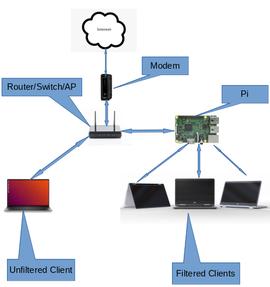

# Introduction

It's March 2020, the Covid-19 pandemic has forced schools to close and some schools have turned to virtual classes. Students now "go to class" by sitting down at the dinner table with a laptop. Sometimes, these laptops arent administered by the school but by parents.

What this means is that the distraction of the general internet is available to the students while they are in school. The following is an attempt to implement some form of parental control in the home

# Requirements
- A working raspberry pi 
    - preferably one with an ethernet connection and wifi. 
    - latest raspbian - at the time of writing, the version is `buster`
- internet source - duh

## My network setup
I have drawn up my home internet for easy refence for all.

  

You will notice I already have a router/switch/Access Point in my home network that wasnt doing the filtering I wanted and I had to introduce the Raspberry Pi 

I need to note that my router is [openWrt](https://openwrt.org) based.

# Software setup

it is best to follow the steps in the order listed below to make things easier for yourself

## On the router
1. set static leases for all your [mac addresses](https://en.wikipedia.org/wiki/MAC_address) on your network. it will help you later if you group devices together. eg 192.168.0.10 to 20 range is for the kids laptops. i found it useful to come up with an [IPAM](https://www.infoblox.com/glossary/ipam-ip-address-management/) table for the blocks. you will need these ranges later when configuring nxfilter

## On the pi
### bridged mode
1. after [installing raspap-gui](https://github.com/billz/raspap-webgui#quick-installer), enable [bridged mode](https://github.com/billz/raspap-webgui/wiki/Bridged-AP-mode)
1. note the new ip and mac address. go back to the router and set it up as a static lease as well

### install nxfilter
1. install [nxfilter](https://www.nxfilter.org) by running the following commands on the pi
    ```
    sudo apt -y install openjdk-8-jre
    wget http://pub.nxfilter.org/nxfilter-4.3.6.2.deb
    apt -y install ./nxfilter-4.3.6.2.deb
    sudo systemctl enable nxfilter
    sudo systemctl start nxfilter
    ```
    
    now both nxfilter and raspap-gui are installed on the pi but both use port 80. so that needs to be fixed by running
    
    ```
    sed -i 's/http_port = 80/http_port = 8080/g' /nxfilter/conf/cfg.properties
    sed -i 's/https_port = 443/https_port = 8443/g' /nxfilter/conf/cfg.properties
    ```
    and restart nxfilter using the command `sudo systemctl start nxfilter`
    
1. we now need to configure nxfilter and the video tutorial called ["Having multiple filtering policies in a school network with NxFilter"](https://www.youtube.com/watch?v=wd1-TOuuiYo) is what we want. for convenience, i have transcribed the process
conditions:
- staffs (user) using ip range 10 - 20
- students (user) using ip range 20 - 30

objective:
- 2 policies - more lenient one for staffs

steps
- enable authentication
- create staffs user account and associate ip range
- create staffs policy
    - block categories
    - apply the policy to user
- create students user account and associate ip range
    - block categories
    - apply the policy to user
    
and thats it for nxfilter configuration

1. configure the router's dhcp server to provide the new internal nxfilter based dns server to all dhcp clients
